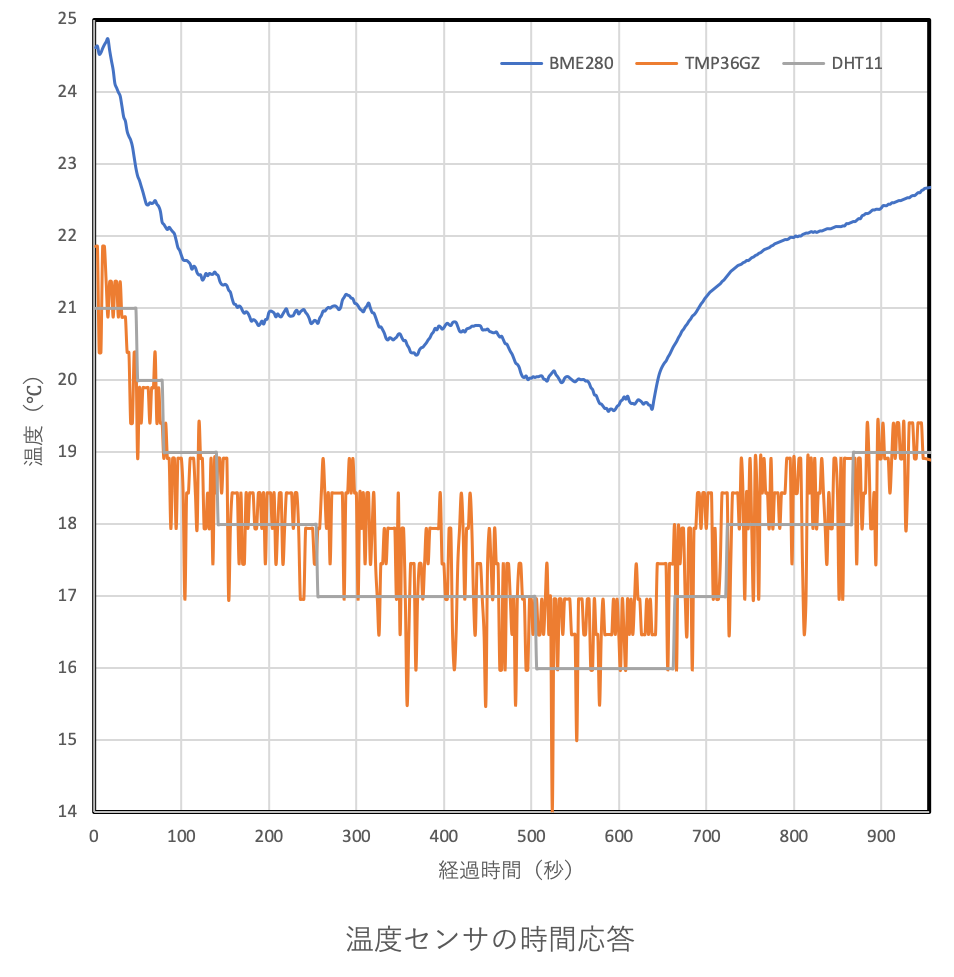

# BME280 温湿度・気圧センサ

written on 2018/11/23, by Ihara

## キット

- BOSCH BME280使用 I2C/SPI対応 温湿度・気圧センサモジュールキット
- [AE-BME280]
- 通販コード　K-09421
- 秋月電子通商
- 発売日　2015/06/01

## 使用ライブラリ

- Adafruitのライブラリ
- https://github.com/adafruit/Adafruit_BME280_Library

## 測定範囲，精度

| 項目 | 内容 |
| ---- | ---- |
| 電源電圧(Vdd) | 	1.71V～3.6V |
| 測定範囲(温度) |	-40℃～+85℃ |
| 精度(温度) |	±1℃ |
| 測定の最小単位(温度) | 0.01℃ |
| 測定範囲(相対湿度) |	0％～100% |
| 精度(湿度) | 	±3% |
| 測定の最小単位(湿度) | 0.008% |
| 測定範囲(気圧) |	300hPa～1100ｈPa |
| 精度(気圧) |	±1hPa |
| 精度(気圧) |	±1hPa |

## 使い方

### 接続方法

- I2Cで、5番ピンをVDDに接続して配線してください
- I2Cのアドレス選択は[0x77]となります
- 以下に配線図を示します
- 3.3Vまでしか対応していないため注意
- SCK（SCL）とSDI（SDA）はプルアップ抵抗が必要？？
  - 中本に確認依頼中
  - J1,J2をジャンパすると基板上のプルアップを使うことが出来て、外部で用意する必要ない？？
  - Wire.hをインクルードするとArduino内部で自動でプルアップしてくれる説もある？？


### プログラム

``` c++
// define
dafruit_BME280 bme;

// check detection
bool status = bme.begin();

// temperature (celcius)
bme.readTemperature()

// pressure (hPa)
bme.readPressure() / 100.0F

// Approx. Altitude (m)
#define SEALEVELPRESSURE_HPA 1013.25
bme.readAltitude(SEALEVELPRESSURE_HPA)

// Humidity (%)
bme.readHumidity()

```

## 検証と懸念点

### 検証内容

> BME280とDHT11とTMP36GZで温度を比較した。
> 室温が約22℃の部屋から気温14℃のベランダに出し、10分間経過後に再び室内に戻した。
> 目的は温度センサの値の精度、安定性、時間応答を見ること。
> 結果としては、BME280が値のブレが少なく安定するものの、時間応答はゆったりでありなかなか定常値に達しなかった。

### 懸念点

- Adafruitのライブラリでは正しい温度より高い値になっている
  - 値の補正、もしくは違うライブラリなどの使用が必要
- 時間応答が気球の上昇速度、落下速度に対して十分早いのか疑問
- 正しい温度変化を得るには、より時間応答が早いものor設定で使用すべき
  - ただ、他のセンサ(TMP36GZ)も同程度の時間応答



## 参考URL

- http://www.ne.jp/asahi/o-family/extdisk/BME280/BME280_DJP.pdf
  - センサのデータシート、私的に日本語に訳されてある

- https://github.com/adafruit/Adafruit_BME280_Library
  - AdafruitのBME280用ライブラリ
  - 温度とかの補正がされているのかどうかは不明
  - Adafruitのモジュールと秋月のものとの差は不明

- https://github.com/SWITCHSCIENCE/samplecodes/tree/master/BME280
  - SWITCH SCIENCEのライブラリ
  - calibrationなどの関数が用意されている

- http://intellectualcuriosity.hatenablog.com/entry/2017/12/14/212651
  - BME280を使った製作例
  - BME280で取得した値をwifi通信している
  - Adafruitライブラリ使用

