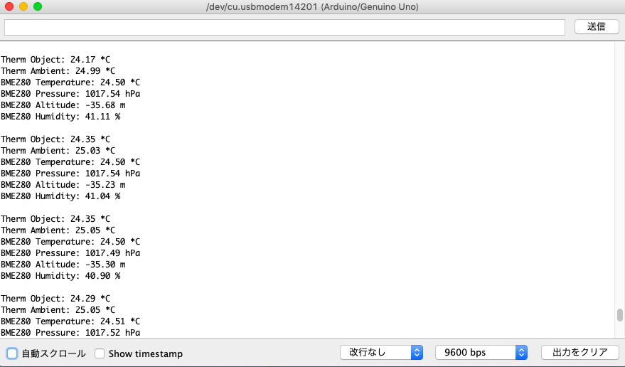

# 複数I2C通信の動作確認(BME280,MLX90614)
written on 2018/12/11, by Nakamoto

## キット

- BOSCH BME280使用 I2C/SPI対応 温湿度・気圧センサモジュールキット
  - [AE-BME280]
  - 通販コード　K-09421
  - 秋月電子通商
  - 発売日　2015/06/01
- MLX90614 赤外線温度センサー

## 使用ライブラリ

MLX90614については上村さんの資料を参考にしました。
- Adafruitのライブラリ(BME280)
  https://github.com/adafruit/Adafruit_BME280_Library
- Sparkfunのライブラリ(MLX90614)
  https://github.com/sparkfun/SparkFun_MLX90614_Arduino_Library/archive/master.zip

## 検証結果
- 複数のI2C通信はできていたようだ。

  

## 懸念事項

- 高度がマイナスになっている。
- 放射温度計でもBME280とほぼ同じ温度になっている。
- 放射温度計の時間応答性は確認していない。
